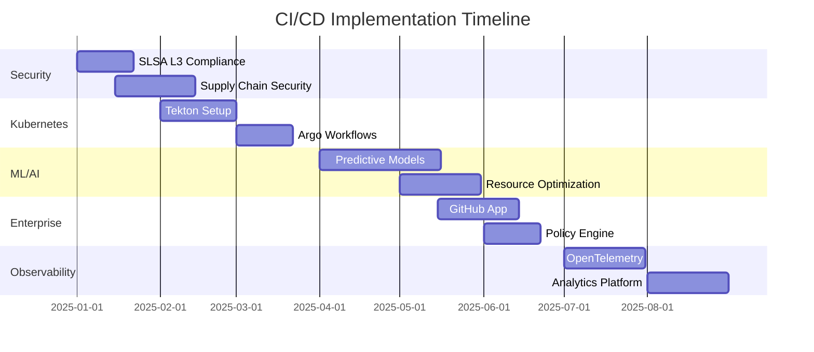

# CI/CD Implementation Roadmap - NetworkX MCP Server

*Generated: 2025-08-28*  
*Status: Active Development*

## 🎯 Executive Summary

This document outlines the comprehensive CI/CD infrastructure implementation for NetworkX MCP Server, incorporating cutting-edge practices from 2025 research and enterprise-grade patterns.

## ✅ Completed Implementations

### Phase 1: Foundation (COMPLETED)

#### 1. Version Control Strategy
- ✅ Comprehensive Git Version Control Strategy document
- ✅ Conventional Commits specification enforcement
- ✅ Branch naming conventions and workflow
- ✅ Release process documentation

#### 2. Continuous Monitoring
- ✅ 15-minute continuous health checks
- ✅ DORA metrics calculation
- ✅ Predictive failure analysis
- ✅ Performance monitoring
- ✅ Security vulnerability scanning

#### 3. Webhook Infrastructure
- ✅ Multi-channel alert system (Slack, Discord, Teams, PagerDuty)
- ✅ Rate limiting and deduplication
- ✅ Alert aggregation and severity management
- ✅ GitHub Issues creation for critical failures

#### 4. Git Hooks Framework
- ✅ Pre-commit quality gates
- ✅ Commit message validation
- ✅ Post-commit metrics tracking
- ✅ Installation automation script
- ✅ Cross-platform compatibility

## 🚀 Upcoming Implementation Phases

### Phase 2: Advanced Security (Q1 2025)

#### SLSA Level 3 Compliance
```yaml
Priority: Critical
Timeline: 2-3 weeks
Dependencies: GitHub Actions, Cosign, Tekton
```

**Implementation Steps:**
1. Set up hermetic build environment
2. Implement provenance generation
3. Add attestation signing with Cosign
4. Create verification workflows
5. Document compliance requirements

#### Supply Chain Security
- [ ] Dependency scanning with Snyk/Dependabot
- [ ] SBOM generation (CycloneDX/SPDX)
- [ ] Container image signing
- [ ] Binary authorization policies
- [ ] Vulnerability database integration

### Phase 3: Kubernetes-Native CI/CD (Q1-Q2 2025)

#### Tekton Pipeline Migration
```yaml
Priority: High
Timeline: 3-4 weeks
Benefits: Scalability, Cost reduction, Native K8s integration
```

**Migration Plan:**
1. Deploy Tekton on K8s cluster
2. Convert GitHub Actions to Tekton Tasks
3. Implement pipeline triggers
4. Set up artifact storage (OCI registry)
5. Configure observability (Jaeger, Prometheus)

#### Argo Workflows Integration
- [ ] Complex workflow orchestration
- [ ] Multi-environment deployments
- [ ] Canary/Blue-green deployments
- [ ] Workflow templates library
- [ ] Event-driven workflows

### Phase 4: ML-Powered Intelligence (Q2 2025)

#### Predictive Failure Detection
```python
Components:
  - Feature extraction pipeline
  - RandomForest/XGBoost models
  - Real-time prediction API
  - Action recommendation engine
```

**Implementation:**
1. Collect historical build data
2. Train failure prediction models
3. Deploy prediction service
4. Integrate with pre-build checks
5. Create feedback loop for model improvement

#### Intelligent Resource Allocation
- [ ] Dynamic runner scaling
- [ ] Cost-based job scheduling
- [ ] Spot instance utilization
- [ ] Performance prediction
- [ ] Auto-optimization algorithms

### Phase 5: Enterprise Features (Q2-Q3 2025)

#### GitHub App Development
```javascript
Features:
  - Custom check runs
  - Advanced merge queue
  - Policy enforcement
  - Automated reviews
  - Performance insights
```

**Capabilities:**
- GraphQL API integration
- Webhook processing at scale
- Custom status checks
- Automated PR management
- Team productivity metrics

#### Policy as Code (OPA)
- [ ] Build policy enforcement
- [ ] Security compliance rules
- [ ] Cost control policies
- [ ] Resource usage limits
- [ ] Automated remediation

### Phase 6: Observability Excellence (Q3 2025)

#### OpenTelemetry Integration
```yaml
Tracing: Jaeger
Metrics: Prometheus + Grafana
Logs: Fluentd + Elasticsearch
```

**Implementation:**
1. Instrument all CI/CD components
2. Create trace correlation
3. Build custom dashboards
4. Set up alerting rules
5. Implement SLO/SLI tracking

#### Advanced Analytics
- [ ] Pipeline bottleneck analysis
- [ ] Developer productivity metrics
- [ ] Cost attribution reports
- [ ] Performance regression detection
- [ ] Failure pattern recognition

## 📊 Implementation Metrics

### Success Criteria

| Metric | Current | Target (Q2 2025) | Target (Q4 2025) |
|--------|---------|------------------|------------------|
| CI Success Rate | ~60% | >95% | >99% |
| Build Time (p50) | 2-3 min | <2 min | <1 min |
| Build Time (p99) | 26 min | <10 min | <5 min |
| MTTR | 30 min | <15 min | <5 min |
| Deployment Frequency | Weekly | Daily | Multiple/day |
| Security Scan Coverage | Basic | SLSA L2 | SLSA L3 |
| Cost per Build | Unknown | <$0.10 | <$0.05 |
| Test Coverage | 25% | >60% | >80% |

### Resource Requirements

**Infrastructure:**
- Kubernetes cluster (min 3 nodes)
- Container registry (Harbor/Artifactory)
- Observability stack (Prometheus, Grafana, Jaeger)
- Secret management (Vault/Sealed Secrets)

**Team Skills:**
- Kubernetes administration
- Tekton/Argo expertise
- Security engineering
- ML/Data science
- SRE practices

## 🔄 Migration Strategy

### Risk Mitigation

1. **Parallel Implementation**: Run new systems alongside existing
2. **Gradual Rollout**: Start with non-critical workflows
3. **Rollback Plans**: Maintain ability to revert quickly
4. **Documentation**: Comprehensive runbooks and guides
5. **Training**: Team education on new tools/practices

### Transition Timeline



## 💰 Cost-Benefit Analysis

### Estimated Costs

| Component | One-time | Monthly | Annual |
|-----------|----------|---------|--------|
| Infrastructure | $5,000 | $500 | $6,000 |
| Tools/Licenses | $2,000 | $300 | $3,600 |
| Training | $10,000 | - | - |
| Implementation | $20,000 | - | - |
| **Total** | **$37,000** | **$800** | **$9,600** |

### Expected Benefits

| Benefit | Annual Value | ROI Timeline |
|---------|--------------|--------------|
| Reduced downtime | $50,000 | 3 months |
| Faster deployments | $30,000 | 6 months |
| Security improvements | $40,000 | 12 months |
| Developer productivity | $60,000 | 9 months |
| **Total Annual Value** | **$180,000** | **6-9 months** |

## 🎯 Quick Wins (Next 2 Weeks)

1. **Install Git Hooks**: Run `.githooks/install.sh`
2. **Enable Monitoring**: Activate continuous monitoring workflow
3. **Configure Webhooks**: Set up alert channels
4. **Document Processes**: Create team runbooks
5. **Train Team**: Conduct knowledge transfer sessions

## 📚 Resources and Documentation

### Internal Documentation
- [Git Version Control Strategy](.github/GIT_VERSION_CONTROL_STRATEGY.md)
- [CI/CD Monitoring Strategy](./CI_CD_MONITORING_STRATEGY.md)
- [Webhook Configuration Guide](./WEBHOOK_SETUP.md)

### External Resources
- [SLSA Framework](https://slsa.dev/)
- [Tekton Documentation](https://tekton.dev/)
- [Argo Workflows](https://argoproj.github.io/workflows/)
- [OpenTelemetry](https://opentelemetry.io/)
- [OPA Policies](https://www.openpolicyagent.org/)

## 🤝 Team Responsibilities

| Role | Responsibilities | Key Deliverables |
|------|-----------------|------------------|
| DevOps Lead | Overall implementation | Architecture, Timeline |
| Security Engineer | SLSA, Supply chain | Compliance, Policies |
| Platform Engineer | K8s, Tekton, Argo | Infrastructure, Pipelines |
| SRE | Monitoring, SLOs | Observability, Alerts |
| ML Engineer | Predictive models | Failure prediction, Optimization |

## ⚠️ Risks and Mitigations

| Risk | Probability | Impact | Mitigation |
|------|-------------|--------|------------|
| Complexity overhead | Medium | High | Phased implementation, training |
| Tool sprawl | High | Medium | Standardize on core toolset |
| Team resistance | Low | High | Early involvement, clear benefits |
| Cost overruns | Medium | Medium | Regular reviews, cost monitoring |
| Security vulnerabilities | Low | Critical | Security-first approach, audits |

## 📝 Next Steps

### Immediate Actions (This Week)
1. ✅ Review and approve this roadmap
2. ⏳ Set up project tracking (GitHub Projects/Jira)
3. ⏳ Schedule team kickoff meeting
4. ⏳ Begin SLSA L3 compliance research
5. ⏳ Start collecting baseline metrics

### Month 1 Milestones
- [ ] Git hooks deployed to all developers
- [ ] Webhook monitoring operational
- [ ] SLSA L3 design complete
- [ ] Tekton POC deployed
- [ ] Team training initiated

## 🎉 Success Celebration Points

- **First SLSA-compliant build**: Team lunch
- **99% CI success rate**: Recognition in all-hands
- **Sub-1 minute builds**: Tech talk presentation
- **Full Tekton migration**: Team offsite
- **ML prediction deployment**: Conference submission

---

*This roadmap is a living document and will be updated quarterly based on progress and changing requirements.*

**Document Owner**: DevOps Team  
**Last Review**: 2025-08-28  
**Next Review**: 2025-09-28

**Approval Chain**:
- [ ] DevOps Lead
- [ ] Engineering Manager
- [ ] Security Lead
- [ ] CTO